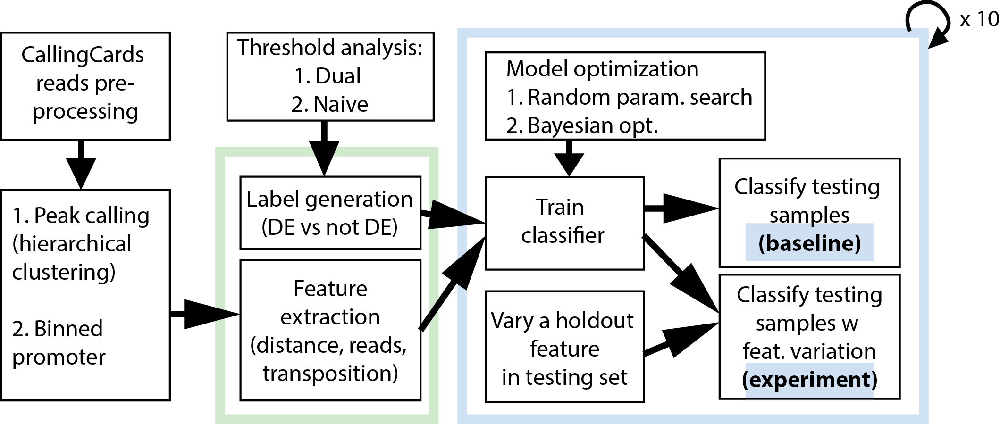

# CallingCards Modeling

This project models the Calling Cards (CC) peaks as the predictors of differentially expressed (DE) or not DE targets. We extract CC features in two approaches.

1. Binned promoter: assign CC features (e.g. TPH, RPH, Log RPH, all subtracted by the no TF background) to bins in promoter, and build a feature matrix
2. Peak calling: hierarchically cluster the transpositions into peaks with pre-defined cutoff, and build feature matrix using the CC features of the first few highest peaks  

There are three approaches to generate the labels of target genes.

1. Use iterative dual thresholding to find the optimal subset of targets that are bound and DE (i.e. positive label)
2. Use unoptimized (naive) p-value threshold to find the targets that are bound and DE
3. Use only p-value threshold on DE analysis to find the DE targets

We rank the CC features by sequantial feature selection to understand their importances. Then we train models by employing machine learning algorithms (currrently implemented: Random Forest, and Gradient Boosting), and evaluate the change in predicting whether a target would be DE or not, by setting a holdout feature in testing set to a specific value. 



### Package Requirement

Install PyYAML, Bayesian Optimization by fmfn (git), and mlxtend by rasbt (git)
    
```
pip install --user pyyaml
pip install --user bayesian-optimization
pip install --user mlxtend  
```

### Example Usage

1. Load modules

	```
	module load pandas
	module load scipy
	module load scikit-learn
    module load matplotlib
	module load biopython
    ```

2. Map transposition data to gene targets, whose promoters range from (-)1000bp upstream to (+)100bp downstream from the ATG. (Input: three-column gnashy files)

	```
	cd scripts
	python compute_orf_hops.py -r ../resources/ -pu -1000 -pd 100 -o ../output/
	```

3. Calculate Poisson statistics of the transpoisitions within the defined promoter region
    ```
    python find_sig_promoters.py -o ../output/ -g ../resources/
    ``` 

4. Extract features
    1. Create 6 bins in promoter, each of which have three feature value, and append three sum of individual feature values in the entire promoter

    ```
    python generate_features.py -m binned_promoter -i ../output/ -o ../output/ -pu -1000 -pd 100 -w 200
    ```

    2. Call peaks, allowing the maximum within cluster distance to be 200, and build feature matrix

	```
	python call_peaks.py -d ../output/ -c 200
    python generate_features.py -m highest_peaks -i ../output/ -o ../output/ -c 200
	``` 

5. Fit tree-based model and visualize data
	
	```
    python fit_model.py -m holdout_feature_variation -t highest_peaks -c ../output/ \
    -l ../resources/optimized_cc_subset.txt -o ../output/feature_holdout_analysis.6_mimic_cc
	```

### Visualizing Peaks in IGV

1. Prepare "data track" file for IGV: convert peak calling file to bedgraph format

    ```
    tail --lines=+2 <peak_file> | awk -F '\t' '{printf "%s\t%d\t%d\t%.3f\n" , $2,$3,$4,$10}' > <peak_file>.bedgraph
    ```

2. Open IGV, load genome, or open the saved IGV session file (*.xml)

